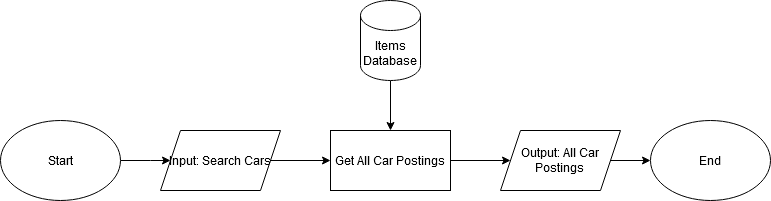
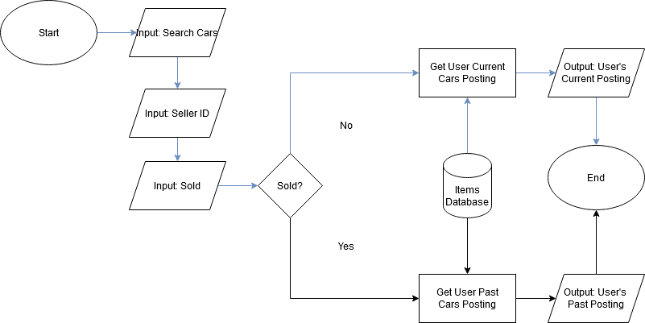
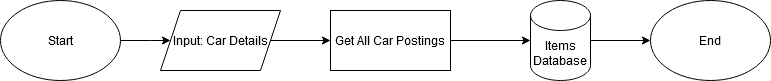
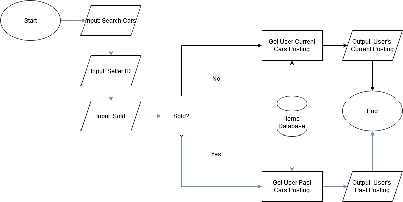
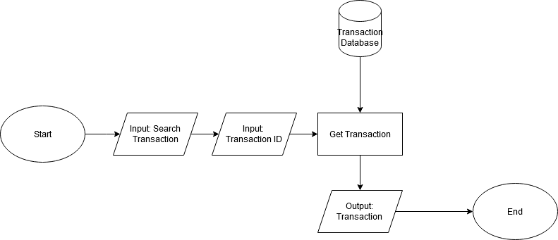
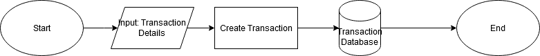

# APIs

## Item Database APIs

### Search for all vehicles

**Input:**

*No Input*

**Example Output:**

```
[
    {
        "_id": "654b35785043e64ab92e859b",
        "brand": "Ford",
        "model": "Mustang",
        "colour": "Red",
        "fuel_type": "Gasoline",
        "mileage": 52000,
        "price": 50000,
        "description": "Looking to sell this retro car",
        "years_used": 15,
        "registration_date": "12-10-2008",
        "category": "car",
        "new_used": false,
        "images": [
            "https://di-uploads-pod41.dealerinspire.com/andersonfordofclinton/uploads/2019/09/2020-Ford-Mustang-MLP-Hero.png",
            "https://di-uploads-pod41.dealerinspire.com/andersonfordofclinton/uploads/2019/09/2020-Ford-Mustang-MLP-Hero.png"
        ],
        "seller": "65389826e5bccac6ac77cac7",
        "sold": false,
        "createdAt": "2023-11-08T07:15:04.235Z",
        "updatedAt": "2023-11-08T07:15:04.235Z",
        "__v": 0
    }
]

```



### Search for vehicles you are selling

**Input:**

| Variable |
|----------|
|Seller|

**Example Output:**

```
[
    {
        "_id": "654b35ff5043e64ab92e859f",
        "brand": "Jeep",
        "model": "Wrangler",
        "colour": "Green",
        "fuel_type": "Hybrid",
        "mileage": 100,
        "price": 35000,
        "description": "Offroader",
        "years_used": 1,
        "registration_date": "12-10-2022",
        "category": "car",
        "new_used": false,
        "images": [
            "https://medias.fcacanada.ca/jellies/renditions/2023/800x510/CC23_JLJL72_2TB_PGG_APA_XXX_XXX_XXX.1aaa5d21f651dcfd23d94bcacebe5ded.png",
            "https://medias.fcacanada.ca/jellies/renditions/2023/800x510/CC23_JLJL72_2TB_PGG_APA_XXX_XXX_XXX.1aaa5d21f651dcfd23d94bcacebe5ded.png"
        ],
        "seller": "65389826e5bccac6ac77cac7",
        "sold": false,
        "createdAt": "2023-11-08T07:17:19.397Z",
        "updatedAt": "2023-11-08T07:17:19.397Z",
        "__v": 0
    }
]
```



### Create new vehicle sale

**Input:**

| Variable |
|----------|
|Brand|
|Model|
|Colour|
|Fuel Type|
|Mileage|
|Price|
|Description|
|Years Used|
|Registration Date|
|Category|
|Used (to be removed)| 
|Images|
|Seller|
|Sold|

**Example Output:**

*No Output*



### Search for vehicles you sold

**Input:**

| Variable |
|----------|
|Seller|
|Sold|

**Example Output:**

```
    {
        "_id": "654b35bb5043e64ab92e859d",
        "brand": "Tesla",
        "model": "Model 3",
        "colour": "Blue",
        "fuel_type": "Electric",
        "mileage": 3300,
        "price": 30000,
        "description": "Mostly Good",
        "years_used": 2,
        "registration_date": "12-10-2021",
        "category": "car",
        "new_used": false,
        "images": [
            "https://cdn.mos.cms.futurecdn.net/VXc2ZjzWGGKGSLAymgeHZ.jpg",
            "https://cdn.mos.cms.futurecdn.net/VXc2ZjzWGGKGSLAymgeHZ.jpg"
        ],
        "seller": "65389826e5bccac6ac77cac7",
        "sold": true,
        "createdAt": "2023-11-08T07:16:11.764Z",
        "updatedAt": "2023-11-08T07:16:11.764Z",
        "__v": 0
    }
```



### Update current vehicle sale

**Input:**

| Variable |
|----------|
|Brand|
|Model|
|Colour|
|Fuel Type|
|Mileage|
|Price|
|Description|
|Years Used|
|Registration Date|
|Category|
|Used (to be removed)| 
|Images|
|Seller|
|Sold|

**Example Output:**

*No Output*


## Transaction Database APIs

### See current auction bids

**Input:**

| Variable |
|----------|
|Item ID|

**Example Output:**

```
[
    {
        "_id": "6538be90304e0545985b39f1",
        "item_id": "6538bdfb304e0545985b39ed",
        "user_id": "65389826e5bccac6ac77cac7",
        "bid_price": 1500,
        "createdAt": "2023-10-25T07:06:56.666Z",
        "updatedAt": "2023-10-25T07:06:56.666Z",
        "__v": 0
    }
]
```



### Create new bids for an auction

**Input:**

| Variable |
|----------|
|Item ID|
|User ID|
|Bid Price|

**Example Output:**

*No Output*


